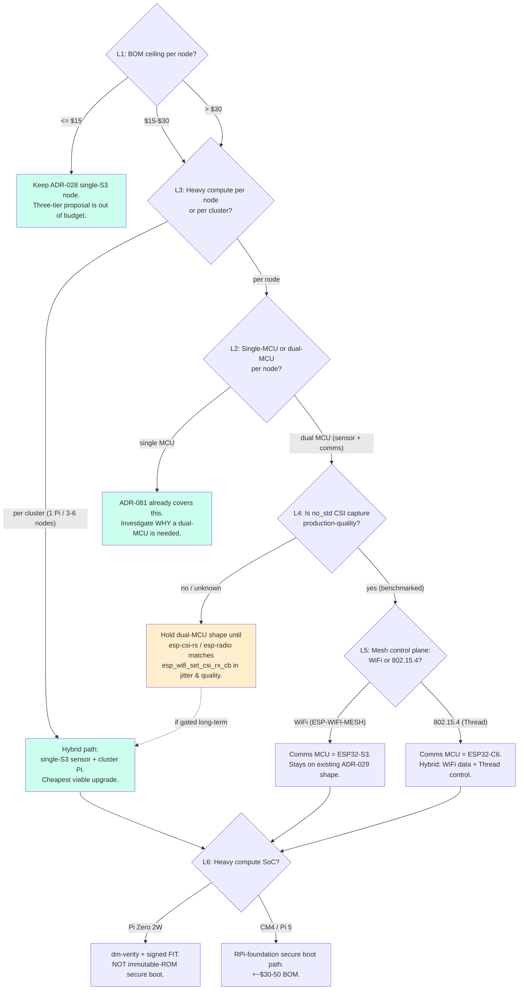

# Three-Tier Node — Decision Tree

| Field        | Value                                                                  |
|--------------|------------------------------------------------------------------------|
| **Status**   | Reference — informs whether/how to adopt the three-tier proposal       |
| **Date**     | 2026-04-25                                                             |
| **Companion**| `architecture/three-tier-rust-node.md`, `sota/2026-Q2-rf-sensing-and-edge-rust.md` |

This document maps each load-bearing decision in the three-tier proposal
to (a) what it depends on, (b) what evidence would justify yes/no, and
(c) which ADR slot would house the decision once made. It is intentionally
short — the prose lives in the SOTA survey and the seed exploration.

---

## 1. Load-bearing vs independent decisions

Six decisions are **load-bearing** — they unblock or block other
decisions:

| #  | Decision                         | Blocks                                   |
|----|----------------------------------|------------------------------------------|
| L1 | Per-node BOM ceiling             | Hardware split, Pi shape, all ADRs below |
| L2 | Single-MCU vs dual-MCU node      | Sensor-MCU runtime, ISR strategy         |
| L3 | One-Pi-per-node vs one-per-cluster | OTA shape, secure-boot story, BOM       |
| L4 | CSI no_std maturity gate         | Sensor-MCU language choice               |
| L5 | Mesh control-plane technology    | Comms MCU choice (S3 vs C6)              |
| L6 | Heavy-compute SoC choice         | Secure-boot path, ML model class         |

Five decisions are **independent** of the three-tier shape and can be
made in parallel:

| #  | Decision                         |
|----|----------------------------------|
| I1 | LoRa fallback chip (SX1262 vs LR1121) |
| I2 | Charger / PMIC (BQ24074 vs BQ25798)   |
| I3 | QUIC vs MQTT-over-TLS for backhaul    |
| I4 | OTA mechanism per die                 |
| I5 | Provisioning protocol (BLE vs USB)    |

---

## 2. Decision tree (Mermaid)

The tree's recommended cheapest-first path is:
**L1 → L3 (per-cluster) → HYBRID**, which keeps today's ESP32-S3 sensor
nodes and adds one Pi per 3–6 nodes. This captures most of the QUIC /
ML / secure-boot value without re-spinning the per-node PCB.

---

## 3. Decision detail — what evidence justifies each branch

### L1 — Per-node BOM ceiling

| Branch                | Evidence required                                                  | ADR slot                             |
|-----------------------|--------------------------------------------------------------------|--------------------------------------|
| ≤ $15                 | Today's $9 BOM, ADR-028 witness; deployment-cost analysis          | No new ADR — keep ADR-028 baseline   |
| $15–$30               | Cost analysis showing single-MCU + cluster-Pi path < $30           | New ADR (e.g., ADR-083)              |
| > $30                 | Deployment-cost analysis showing per-node Pi pays for itself       | Two ADRs (per-node Pi, BOM revision) |

### L2 — Single vs dual MCU per node

| Branch       | Evidence required                                                                          | ADR slot                       |
|--------------|--------------------------------------------------------------------------------------------|--------------------------------|
| Single MCU   | ADR-081 5-layer kernel measurements (already 60 byte feature packets, 0.003% CPU at 5 Hz) | No new ADR — keep ADR-081      |
| Dual MCU     | Measured ISR-jitter problem on single-MCU node; or no_std-CSI maturity demonstrated        | New ADR (firmware split)       |

### L3 — Per-node vs per-cluster heavy compute

| Branch        | Evidence required                                                                             | ADR slot                       |
|---------------|-----------------------------------------------------------------------------------------------|--------------------------------|
| Per cluster   | Throughput math: 6 nodes × 5 Hz × 60 B = 1.8 KB/s per cluster; well within USB/Ethernet to Pi | New ADR (cluster-Pi shape)     |
| Per node      | Need: per-node ML, per-node QUIC, per-node secure boot, deployment without LAN gateway        | New ADR (per-node Pi shape)    |

### L4 — CSI no_std maturity gate

| Branch     | Evidence required                                                                                                              | ADR slot                                  |
|------------|--------------------------------------------------------------------------------------------------------------------------------|-------------------------------------------|
| Mature     | esp-csi-rs (or replacement) on real S3 board: matches esp_wifi_set_csi_rx_cb capture rate, frame-loss, ISR-jitter              | Phase-4 of ADR-081 + a `no_std` migration ADR |
| Not mature | Side-by-side benchmark shows ≥10% drop in capture quality, or ISR-jitter > 100 µs                                              | Defer — remain on ESP-IDF C path          |

### L5 — Mesh control-plane technology

| Branch          | Evidence required                                                                                            | ADR slot                                    |
|-----------------|--------------------------------------------------------------------------------------------------------------|---------------------------------------------|
| ESP-WIFI-MESH   | ≤ 25-node target; existing ADR-029 + ADR-073 hold                                                            | No new ADR — keep ADR-029                   |
| Thread          | ≥ 50-node target; field test showing ESP-WIFI-MESH degradation; comms-MCU change to ESP32-C6 acceptable      | New ADR (Thread control plane)              |
| `esp-mesh-lite` | Wanting IP-layer routing for QUIC + WiFi homogeneity, but staying on S3                                       | New ADR (mesh-lite migration)               |

### L6 — Heavy-compute SoC choice

| Branch     | Evidence required                                                                                            | ADR slot                                |
|------------|--------------------------------------------------------------------------------------------------------------|-----------------------------------------|
| Pi Zero 2W | Buildroot + dm-verity + signed FIT meets the threat model; cost / power matters more than ROM-rooted boot    | New ADR (Pi Zero 2W image / OTA)        |
| CM4 / Pi 5 | True ROM-rooted secure boot is deployment-required (e.g., regulated environment)                              | New ADR (CM4 image / OTA)               |

---

## 4. Independent decisions — make in parallel

Each of these can be evaluated in isolation; none depend on the L-decisions.

| #  | Decision                              | Default recommendation                                                                                                                                                                      | ADR slot            |
|----|---------------------------------------|---------------------------------------------------------------------------------------------------------------------------------------------------------------------------------------------|---------------------|
| I1 | LoRa fallback chip                    | **SX1262.** LR1121 only if global / 2.4 GHz / satellite roaming is a deployment requirement. (SOTA §6)                                                                                       | ADR (LoRa fallback) |
| I2 | PMIC choice                           | **BQ24074 if panel ≤ 2 W**, **BQ25798 if panel ≥ 5 W or solar-only**. SPV1050 only for sub-watt energy harvesting. (SOTA §7)                                                                | ADR (power path)    |
| I3 | Backhaul protocol                     | **QUIC (`quinn` + `rustls`)** if bidirectional / large payload / mobile-network handoff matters. **MQTT-over-TLS** for low-rate publish-only. (SOTA §5)                                      | ADR (backhaul)      |
| I4 | OTA per die                           | **`embassy-boot` two-slot** on no_std MCUs. **ESP-IDF native OTA** on ESP-IDF MCUs. **A/B + signed FIT** on Pi. (SOTA §3, §9)                                                                | ADR (OTA)           |
| I5 | Provisioning protocol                 | **BLE provisioning via `esp-idf-svc`** for any in-field reprovisioning; **USB / serial** for factory provisioning only. (No SOTA section — well-trodden ground.)                            | ADR (provisioning)  |

---

## 5. Recommended ADR sequence

If the three-tier proposal is partially adopted, the recommended ADR
sequence is **outside-in** — address the cheapest, most independent
decisions first, gate the load-bearing ones on real evidence:

1. **Independent ADRs first** (any order):
   - I1 LoRa fallback chip choice.
   - I2 Power-path / PMIC choice (probably BQ24074 if panel stays ≤ 2 W,
     BQ25798 otherwise).
   - I3 QUIC vs MQTT-over-TLS (likely MQTT for the heartbeat-only case,
     QUIC if model updates and fleet sync are real).
2. **Per-cluster-Pi ADR** (L3, hybrid branch) — the high-value, low-cost
   first step. One Pi per 3–6 nodes. Captures most of the ML/QUIC/
   secure-boot value at minimal per-sensor BOM impact.
3. **Mesh control-plane ADR** (L5) — only if deployments target > 25
   nodes. Otherwise stays on ESP-WIFI-MESH per ADR-029.
4. **CSI no_std maturity benchmark ADR** (L4 evidence) — investigate,
   but do not commit to dual-MCU until benchmarked.
5. **Dual-MCU node ADR** (L2) — only after L4 evidence + a clear ML or
   ISR-jitter problem on the single-MCU node.
6. **Three-tier-PCB ADR** (full proposal) — last, only if BOM / threat-
   model / scale all justify it.

This ordering deliberately keeps the bulk of the deployable surface on
today's ADR-028 / ADR-081 baseline while letting each separable
upgrade be evaluated on its own evidence.

---

## 6. Out-of-scope for this document

- **Re-evaluating ADR-029 mesh choices** beyond mentioning Thread as
  alternative — that belongs in a Mesh-control-plane ADR.
- **Specific PCB layout** of any of the candidate boards.
- **Cloud-side architecture** (gateway, fleet-sync target, time-series
  storage). Out of scope of the node architecture proposal.
- **Cross-environment domain generalization (ADR-027)** — orthogonal to
  the hardware shape.
- **Multistatic fusion algorithms** (`wifi-densepose-ruvector::viewpoint`)
  — orthogonal to the hardware shape.

---

## 7. References to other documents in this set

- `architecture/three-tier-rust-node.md` — the seed proposal.
- `sota/2026-Q2-rf-sensing-and-edge-rust.md` — SOTA evidence per topic.
- `architecture/implementation-plan.md` — earlier (2026-04-02) GOAP plan
  for ESP32-S3 + Pi Zero 2 W; the three-tier proposal is most usefully
  read as an extension of this plan.
- `architecture/ruvsense-multistatic-fidelity-architecture.md` —
  multistatic fusion architecture, orthogonal to node hardware shape.
