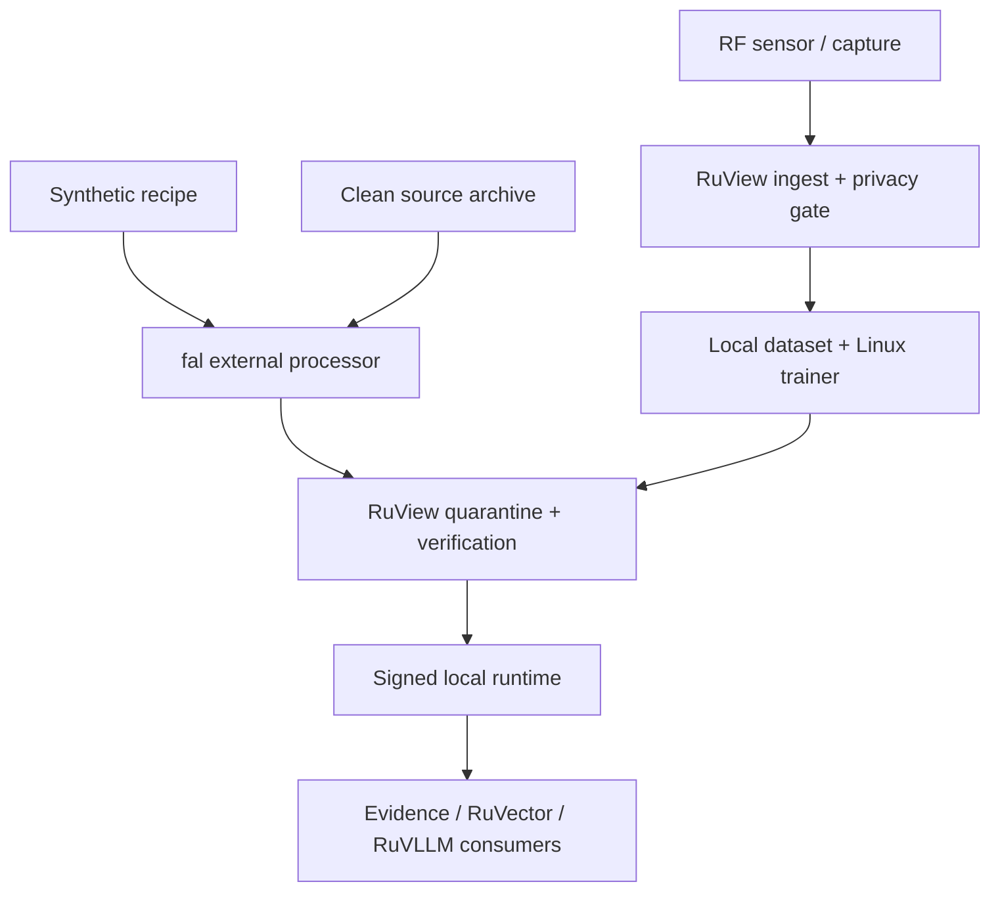

# RuView Forecast security and privacy threat model

- **Status:** normative implementation and release gate
- **Date:** 2026-09-01
- **Scope:** `ruview-forecast-core`, `ruview-forecast-model`,
  `ruview-forecast-train`, RuView API integration, RuVector retrieval, and hosted
  training on fal
- **Extends:** ADR-260, ADR-262, ADR-271, ADR-295, ADR-299, ADR-304, ADR-305,
  ADR-319, and ADR-348
- **Evidence grade:** design review plus repository inspection; no production
  forecast artifact or hosted training run was inspected

## Security decision

Forecasting may be implemented only as a bounded, advisory, derived-evidence
subsystem. Real RF data remains subject to RuView's person-data rules even when
it is converted into a time series. Hosted training is an external trust
boundary, not an extension of the RuView edge.

The initial release MUST enforce these rules:

1. **Hosted v1 is synthetic-pretraining only.** No real RuView RF-derived data
   of any privacy class, external dataset path/bytes, `DataPolicy`, tenant/site/
   device/session identifier, split membership, or RuVector record may be sent
   to fal. All real-data training runs stay on the operator-controlled Linux
   host.
2. Fal receives only a bounded, server-authored synthetic generator recipe,
   seed, model/optimizer profile, clean-room identity, and budget. Conditional
   P1/P2 export requires a future privacy/DPA design decision and implementation;
   it is ADR-only and MUST fail closed in v1 even when a receipt field is
   present. The deployment build context is part of this egress boundary: it
  MUST be produced from an exact-file/three-Rust-source-tree clean tracked-source archive and MUST
   NOT upload the operator's working tree, untracked files, local requests,
   datasets, credentials, or unrelated RuView fixtures.
3. A fal result is untrusted input. It MUST be downloaded into quarantine,
   size-bounded, hashed, schema-checked, evaluated locally, and signed by a
   RuView release key that never leaves RuView control before activation.
4. Forecasts MUST remain `DERIVED_FORECAST` evidence. They MUST NOT overwrite
   observations, become `MEASURED`, raise the evidence level of an unauthenticated
   RF source, or independently authorize a life-safety or physical action.
5. Every mutating route, including submit, cancel, delete, retrain, stage,
   promote, activate, and rollback, requires `sensing:admin` by default.
6. Invalid or ambiguous security state fails closed. Missing history, stale or
   OOD input, invalid model output, and unavailable retrieval cause abstention;
   they never cause a synthetic/live fallback or reuse of a prior forecast as a
   current observation.

## Review and clean-room exposure statement

This review inspected RuView repository policy, privacy, authentication,
attestation, evidence, witness, artifact-verification, dataset-ingest, and CI
code, together with fal's public operational documentation. It did **not**
inspect, copy, download, execute, or query Google TimesFM source code,
configuration, tests, checkpoints, weights, activations, or outputs. No Google
model output or similarity oracle was used. ADR-348's independently authored
RuView requirements are the forecasting specification for this review.

The review was read-only until this document was requested. The checked base
state was commit `e04f269f1a76eb6ed4e8cd33e2ccfeda6fd391a3`; the reviewed
`v2/Cargo.lock` SHA-256 was
`ae160f76b1a0bfb2dd1917543c40003f7a2abd3599eee2340d92e143dca35c2c`.
No forecast crate existed in that base commit. New, uncommitted forecast files
appeared during the review and received a follow-up read-only pass. They were an
in-progress working-tree snapshot without a stable commit identity. The
implementation findings below must be rechecked against the final diff; no gate
is claimed to pass merely because a draft type or test exists.

## In-progress implementation findings

| ID | Severity | Snapshot evidence | Required closure |
|---|---|---|---|
| RFSEC-001 | **Critical** | `ruview-forecast-core/src/series.rs:147-210` carries evidence state but no ADR-260 privacy/tenant policy; `ruview-forecast-train/src/config.rs:218-359` binds dataset path/size/hash but no privacy class, tenant/account/workspace, purpose, consent/DPA, retention or export decision. | Bind real data to a validated local policy, but make hosted v1 a separate synthetic-recipe-only DTO. Reject every real/external dataset, including P1/P2, before network I/O. Evidence class is not privacy class. |
| RFSEC-002 | **Critical** | `ruview-forecast-model/src/artifact.rs:42-105,145-175` checks a BLAKE3 weights digest declared inside the same unsigned manifest. An attacker able to replace both weights and manifest satisfies that check. | Treat it only as an untrusted candidate, then require a domain-separated canonical manifest signature, local Ed25519 signer allowlist, compatibility/finite checks and a nonconstructible activated-artifact wrapper. Fal never receives the release key. |
| RFSEC-003 | **High** | `ruview-forecast-model/src/config.rs:126-217` has no hard dimension/activation caps, and expressions such as `3 * patch_len`, `6 * d`, `2 * d`, `3 * d`, `q * r` and `q * horizon` can overflow before the checked helpers. Patch/layer allocation is not bounded by parameter count alone. | Add per-dimension, parameter, patch/token, activation-byte and total-work caps. Use checked arithmetic for every intermediate before model allocation. |
| RFSEC-004 | **High** | `ruview-forecast-model/src/network.rs:43-60,278-361` validates tensor shapes but not batch/total cells, finite values, binary masks, bounded ages or finite outputs. | Require a validated input wrapper or adapter gate and post-inference finite/order validation; malformed data must return an error/abstention before backend panic or propagation. |
| RFSEC-005 | **High** | `ruview-forecast-train/src/artifact.rs:117-146,245-264` canonicalizes a path and later opens it; existing final paths are reopened without no-follow semantics. Directory or final symlinks can race the check. | Use capability/open-at/no-follow handling, verify the opened handle, and keep root/job directories mode `0700` with files `0600`. Do not trust a lexical/canonical path checked before open. |
| RFSEC-006 | **High** | `ruview-forecast-train/src/config.rs:396-421` checks path metadata and then calls `std::fs::read`, permitting replacement or growth between the check and unbounded read. | Open once, inspect the handle, read through `take(MAX+1)`, and reject any over-limit/trailing byte before parsing. |
| RFSEC-007 | **High** | `ruview-forecast-train/src/artifact.rs:77-90` directly deserializes an absolute `provider_path`, size and digest with public fields. | Return a bounded opaque artifact ID or validated provider-relative handle. Treat all fal descriptors as wire DTOs and revalidate before URL construction or file access. |
| RFSEC-008 | **Medium** | `ruview-forecast-train/src/config.rs:12-16,297-339` permits a 512 GiB dataset, 10,000 epochs and batch 8,192 without a tenant budget, wall-time or total-work estimate. | Apply deployment-lower byte limits plus checked work/GPU-hour/currency, attempt, wall-time and concurrency quotas before submission. |
| RFSEC-009 | **High** | `.github/workflows/ruforecast-ci.yml:206-232` exercises `cpu`/`cli`, while train's `server` and `fal-client` feature surfaces are not compiled, tested or linted. | Add mock-network jobs for `server,fal-client`, security-contract tests, blocking secret/privacy gates, and fuzz/property jobs before merging external integration. |

### Closure re-review ledger

The table above records the first implementation snapshot. The final PR pass
has the following disposition. “Addressed” means the reviewed software path is
present; it is not production approval and does not replace an operational
test on the exact release artifact.

- **RFSEC-001 is addressed for the v1 software boundary.** Local series and
  requests carry a constructor-validated `DataPolicy`. The hosted request is a
  separate closed synthetic-only DTO that cannot serialize a policy, path,
  dataset bytes, split, or tenant/site/device/session identity. Provider
  retention, account isolation, and deletion remain operational release gates.
- **RFSEC-002 is partially addressed.** Candidate bytes have no activation
  authority. Activation requires a domain-separated Ed25519 envelope, local
  signer allowlist, compatibility checks, and nonconstructible activated type.
  The current public activation policy still accepts caller-supplied epoch,
  runtime, clock and schema values. Production remains blocked on a
  service-owned policy constructor that binds the compiled runtime, trusted
  clock and selected schema, plus a durable atomic store for
  `{release_epoch, same_epoch_digest}` and the last-known-good model that
  survives crash/restart tests.
- **RFSEC-003 is addressed for the two activatable v1 profiles.** Dimensions,
  patch count, parameters, activation cells, input cells, and checked forward
  multiply-adds are bounded. Only exact `tiny_ci` and `large_linux` profiles
  validate; a low-parameter/high-attention adversarial configuration is
  rejected. Batch work is checked before training allocation and again at the
  model boundary. A future profile is a security-reviewed code change.
- **RFSEC-004 is partially addressed.** `ModelInput` has private fields and
  validates batch, shapes, cells, finite values, masks, ages, validity rows,
  activation work, and output finiteness/order. Local JSONL is byte- and
  shape-gated before tensor creation. The library still accepts already-created
  Burn tensors, so a production network adapter must add a bounded DTO-to-tensor
  gate before exposing inference to untrusted input. No such route ships here.
- **RFSEC-005 and RFSEC-006 are addressed for local files.** Requests and
  datasets use no-follow/nonblocking capability opens, regular/single-link
  checks, bounded streaming reads, exact size/digest checks, private modes, and
  atomic fixed-name publication. Every JSONL epoch re-hashes the exact bytes
  consumed; publication failure removes the complete candidate set.
- **RFSEC-007 is addressed.** Provider responses carry only an opaque validated
  job/kind identity and four fixed descriptors. URLs and local paths are built
  from configured roots plus those types, then size/hash checked in quarantine.
  The hosted receipt body currently receives only a minimal request-digest and
  unsigned/untrusted projection check; strict full receipt schema and lineage
  binding to the job, build, schema, manifest, candidate, checkpoint, terminal
  status and reconciled cost remain a production import gate. This PR has no
  promotion or import path, so provider bytes retain no activation authority.
- **RFSEC-008 is partially addressed.** Dataset, optimizer, activation, memory,
  artifact, checkpoint, wall-time, billable-time, and request spend fields are
  bounded; hosted execution is one-slot and does not automatically resubmit an
  ambiguous submit. `max_micro_usd` is not provider-enforced, provider billing
  is not reconciled, and account-wide concurrency/attempt reservation is an
  external control. Hosted production remains blocked.
- **RFSEC-009 is addressed for PR CI.** The workflow separately compiles,
  tests, and lints backend-free, CPU, RuVector, hosted `server,fal-client`, and
  compile-only CUDA/WGPU surfaces, with clean-room, secret, and hosted-wire
  scans. Fuzzing, container scanning, live Fal, GPU runtime, and measured
  resource evidence remain release gates.

The local policy retention timestamp is an admission and execution deadline,
not a deletion scheduler. Local JSONL, candidates, checkpoints, manifests and
receipts persist until the operator's storage policy removes them. A production
service remains blocked on authenticated lifecycle ownership, crash/restart
deletion tests and an auditable deletion receipt.

Positive snapshot patterns worth preserving include private fields plus
constructor-validating custom `Deserialize` in forecast core, finite/shape
validation in `TimeSeries`, canonical domain-separated SHA-256 digests,
`deny_unknown_fields` on training requests, fixed typed devices/model profiles,
create-new temporary artifact files, streamed dataset hashing, fixed artifact
filenames, and the test that rejects a dataset symlink escaping its root. These
reduce risk but do not close the findings above.

### RuVector feature release gate

The optional RuVector adapter remains **blocked from production activation**,
but the evaluation-only construction path now pins `ruvector-core = 2.3.0`
with default features disabled and `memory-only,hnsw` enabled. It accepts at
most 1,024 elements and rejects an index before `VectorDB::new` unless checked
accounting for embedding copies, HNSW links/layers, forecast patches, record
metadata, and bounded search scratch fits a 128 MiB ceiling:

```text
embedding bytes + HNSW links/levels + forecast-patch bytes
  + opaque record/digest metadata + search scratch
```

Search fixes `ef_search=64`, validates bounded `k`, deduplicates provider
results, and rechecks finite distances and split scope. The constructor is
`pub(crate)`, so no downstream production service can instantiate the adapter
in this change. A production adapter still needs authenticated scope creation,
concurrency/deadline control, measured allocator/RSS evidence, and a deployment
memory reservation.

Record identifiers MUST be fixed opaque digests (for v1, exactly 64 lowercase
hex SHA-256 characters) generated from a domain-separated local identifier.
Arbitrary caller strings such as names, email addresses, device IDs, or room
labels must never enter the vector database or an `AnalogMatch`. A public query
must not supply its own scope authority: the service derives tenant/account/
workspace and split from an authenticated principal plus a locally selected
split, then hands the adapter a nonconstructible verified scope.

The adapter no longer uses the unsafe `":memory:"` string. It creates a private
mode-0700 temporary directory and mode-0600 empty probe file, and fails closed
if the memory-only backend writes it. `clear()` drops the entire HNSW database
before rebuilding, because per-record removal retains vectors in the pinned
provider. Explicit close/drop removes the capability. This proves the reviewed
feature path did not write the probe; it does not promise memory zeroization or
crash cleanup. Persistent or production use still requires tenant-scoped
retention, deletion, audit, and residual-data tests.

### Training runner release gate

The runner output remains candidate evidence, not a release. Provider JSON is
decoded into a private strict wire and reconstructed against the configured
app plus expected request, job, worker build, build manifest, expiry, and four
artifact kinds. `production_signed` must be false. Downloads enter a
capability-confined quarantine and are re-hashed; no signing/promotion command
is included in this change.

Preflight uses checked parameter, activation, forward-work, decoded-shuffle,
serialization, and overhead estimates, then enforces optimizer-step,
checkpoint, cumulative artifact, retention, and whole-invocation wall bounds.
The multiplier remains a conservative engineering estimate, not measured
allocator proof. Retention and wall bounds are checked around every durable
publication. Normal final publication also requires cancellation to remain
clear; an observed cooperative cancellation may intentionally publish only its
bounded checkpoint. A returned partial failure rolls back the fixed outputs,
while crash-atomic four-file publication remains a production gate. Peak RSS
and large-profile throughput remain unmeasured release evidence.

The canonical run identity binds optimizer, checkpoint, model, device, budget,
source commit, lockfile, toolchain/target, container, data/generator, split, and
feature-schema identities. Hosted build values are compiled into the worker and
must match the request. Missing build environment values remain visibly
`UNVERIFIED`; they are not fabricated. A hosted candidate has no release epoch
or signing authority.

## Repository security anchors

The forecast implementation MUST preserve these existing RuView contracts:

| Contract | Repository evidence | Forecast consequence |
|---|---|---|
| Raw CSI is person data | `docs/adr/ADR-299-csi-data-incident-repo-controls.md:10-17` records that raw CSI encodes breathing, movement, and presence. | Raw capture is never a normal fixture, log, hosted-training payload, or release artifact. |
| Only synthetic or expressly consented minimal CSI fixtures may be committed | `ADR-299:23-28`, `.github/workflows/csi-data-policy.yml:36-42`, and `scripts/csi-data-policy-check.sh:31-38,150-184`. | Forecast tests generate data in code or use an approved minimal fixture. |
| Privacy is semantic, not only a file format | `docs/adr/ADR-260-rufield-mfs.md:160-175` defines P0-P5 and requires provenance. | Derived windows are classified by information content and intended use, not merely relabelled P1. |
| Live egress is fail-closed | `docs/adr/ADR-262-rufield-ruview-integration.md:26-41` maps derived biometric content to P4/P5 and permits only P1/P2 on its unattended surface. | The feature exporter must reject a field whose effective privacy exceeds its destination policy. |
| The current live UDP source is not authenticated | `v2/crates/wifi-densepose-sensing-server/SECURITY.md:5-14,32-49`. | A capture from the current data plane is `LiveUnverified`; forecasting cannot mint L5 provenance from it. |
| Mutations are admin by default | `v2/crates/wifi-densepose-sensing-server/src/bearer_auth.rs:433-470` documents the prior training-route scope hole and now defaults every mutation to `sensing:admin`. | New forecast routes inherit this polarity; no route-prefix denylist is permitted. |
| Audience and scope are independent | `v2/crates/ruview-auth/src/verify.rs:40-53,165-246`; scopes are exact in `v2/crates/ruview-auth/src/principal.rs:78-86`. | Require a configured nonempty client allowlist, exact scope, account, and workspace binding. |
| Verified values should be constructed only after verification | `v2/crates/ruview-auth/src/principal.rs:28-30` and `v2/crates/ruview-attest/src/lib.rs:420-476`. | Remote DTOs must not deserialize directly into trusted forecast, artifact, attestation, or evidence types. |
| Artifacts load only after verification | `v2/crates/wifi-densepose-physics/src/learned/model.rs:58-66`. | Parse model tensors only after byte, signer, schema, and compatibility gates. |
| Production signature policy rejects unsigned input | `v2/crates/homecore-plugins/src/verify.rs:9-35,95-190`. | Forecast production has no `AllowUnsigned` path. |
| Parsers are bounded and panic-free | `v2/crates/wifi-densepose-train/src/dataset/widar.rs:8-17,105-116,175-250`. | All remote formats get byte, record, shape, and allocation caps before decoding. |

## Assets and security objectives

| Asset | Objective |
|---|---|
| Raw and derived RF windows | Confidentiality, tenant isolation, consent, minimization, bounded retention, lineage |
| Labels and future covariates | Integrity, rights provenance, no future leakage, no subject crossover |
| Fal API credential | Confidentiality, least scope, rotation, no client/log/artifact exposure |
| RuView release signing key | Local-only custody, non-exportability where practical, separate dev/prod keys |
| Training configuration and code | Immutable identity, clean-room provenance, reproducibility |
| Checkpoint and release model | Byte integrity, signer authenticity, schema compatibility, anti-rollback |
| Forecast and quantiles | Finite/bounded values, calibration identity, source/evidence honesty |
| RuVector analogue index | Split isolation, tenant isolation, deletion, neighbour-ID confidentiality |
| Job and promotion records | Attribution, idempotency, cost limits, append-only audit |

## Data classification and permitted destinations

Classification follows ADR-260 and is monotonic: a transform does not lower a
class merely because the output has fewer columns. A lower class requires a
documented privacy-reduction transform and a test demonstrating that prohibited
information is absent. When inputs differ, use the most restrictive applicable
source, semantic, consent, and destination class.

| Data | Minimum class | Local Linux | Fal | Repository / CI artifact |
|---|---:|---:|---:|---:|
| Raw CSI, phase/amplitude frames, radar cube | P0 | Temporary, encrypted, authorized | **DENY** | **DENY** |
| Derived non-identity radio statistics with identifiers and precise time removed | P1 | Allow | **DENY in v1** | Synthetic/minimal only |
| Occupancy, motion, bed-exit, room routine series | P2 | Allow | **DENY in v1** | Synthetic/minimal only |
| Anonymous aggregates | P3 | Allow | **DENY in v1** | Aggregate reports only |
| Breathing, heart rate, gait, sleep, fall/health target | P4 | Explicit consent; restricted | **DENY by default** | **DENY** |
| Named/persistent person, face/re-ID/subject-linked series | P5 | Identity binding and audit | **DENY** | **DENY** |
| Hash/HMAC/pseudonym derived from a tenant, site, room, device, session, subject or local job label | At least source class | Policy-scoped only | **DENY in v1** | **DENY** unless an approved aggregate |
| RuVector neighbour IDs/distances | At least source class | Tenant/split scoped | **DENY by default** | Hashed aggregate metrics only |
| Model trained on customer-derived data | At least Restricted until leakage review | Quarantine/release store | **DENY in v1** | No weight blob in ordinary CI |
| Forecast of a P4/P5 target | P4/P5 | Restricted | Not a hosted-training response payload | No raw values in telemetry |
| Synthetic generated windows and labels | Content-dependent privacy; L0 evidence | Allow | Allow | Minimal deterministic fixtures allowed |

There is no real-data fal exporter in v1. Local dataset manifests MUST retain
privacy, tenant/account, consent/purpose, schema, time-range, and provenance
bindings, but none of those records or dataset shards cross the hosted boundary.
The separate fal DTO carries only a server-approved synthetic generator ID and
version, bounded generator parameters, seed, model/optimizer profile, clean-room
identity and budget. It has no generic path, byte blob, URL, policy, source,
tenant or split field.

Model weights can memorize training data. Until membership-inference,
canary-extraction, nearest-neighbour, and subject-linkage checks pass, a model
trained on customer-derived data inherits a restricted handling policy even if
its tensor format contains no explicit identifier.

## Trust boundaries



| Boundary | Untrusted side | Required gate |
|---|---|---|
| TB1 sensor to ingest | UDP frame/source | Source state, frame bounds, device attestation when available, replay/freshness; otherwise `LiveUnverified` |
| TB2 ingest to dataset | Feature producer and labels | Schema, privacy/consent, tenant, timestamp, finiteness, split and provenance validation |
| TB3 RuView to fal | Hosted provider, network, shared account resources | Synthetic-only DTO, approved app, least-scope key, storage/ACL/retention controls, cost authorization |
| TB4 fal webhook/result to RuView | HTTP headers/body/URLs/provider state | Raw-body signature, timestamp, expected request/user, replay/idempotency, body cap, fixed JWKS |
| TB5 model bytes to parser/runtime | Downloaded bytes and manifest | Streaming length/hash, canonical Ed25519 signature, signer allowlist, schema/tensor/finite checks |
| TB6 client to forecast/admin API | Bearer token and request | ES256 verifier, exact client/scope, tenant binding, rate/quota, strict DTO validation |
| TB7 forecast to downstream systems | Model output and optional explanation | Derived-evidence label, uncertainty/abstention, no numeric mutation, no autonomous action |
| TB8 API/service to RuVector | Caller identity, query, record ID, index capacity | Principal-derived verified scope, opaque digest IDs, pre-allocation byte reservation, bounded search |
| TB9 source tree to fal image builder | Docker context, package manager, base image and build logs | Clean tracked-file allowlist, no local data/secrets, digest-pinned inputs, SBOM/provenance, secret and CSI policy gates before upload |

## STRIDE analysis

| STRIDE | Threat | Boundary | Impact | Required control |
|---|---|---|---|---|
| Spoofing | Forged live CSI creates a plausible training trajectory | TB1 | Poisoned model and false provenance | Integrate ADR-305 attestation; until then retain `LiveUnverified`, device/network allowlist is not authentication |
| Spoofing | Forged fal callback or result for another job/account | TB4 | Attacker-selected artifact, cost/audit confusion | Verify fal Ed25519 raw-body signature, ±300 s timestamp, exact expected user/request ID and one-time nonce; idempotency ledger |
| Spoofing | Token minted for another Cognitum client or tenant | TB6 | Cross-product or cross-tenant access | Nonempty exact client allowlist; bind account/workspace from verified `Principal`, never from request JSON |
| Spoofing | Unknown artifact publisher | TB5 | Malicious model activation | Local release signer allowlist; no caller-constructible verification receipt |
| Tampering | Dataset, labels, split manifest, config, or seed changes | TB2/TB3 | Poisoning, leakage, irreproducible claims | Content-address every input; canonical signed run manifest; verify before training and again in the receipt |
| Tampering | Model or normalization is changed independently of manifest | TB5 | Silent wrong inference or parser attack | Signature covers canonical manifest and hashes of all payloads; verify actual bytes before decode |
| Tampering | Witness/evidence JSON forges a higher evidence level | TB4/TB7 | False assurance | Deserialize bounded wire DTOs and reconstruct via validated constructors; never trust serialized `VerifiedMeasurement`/ledger objects |
| Repudiation | User disputes a costly run, cancellation, or promotion | TB3/TB6 | Spend and governance dispute | Append actor `sub/account/workspace/jti`, request/idempotency IDs, code/data/config digests, provider job ID, state transition, time and reason |
| Repudiation | Provider result cannot be linked to submitted inputs | TB3/TB4 | Unverifiable checkpoint | Signed training receipt binds request ID, source commit, lock/container, data/config hashes, hardware and output digests |
| Information disclosure | Real RF-derived data or identifiers reach request history, fal CDN, logs, or shared `/data` | TB3 | Person/health/identity data incident | Synthetic-only v1 DTO; private app auth; no input upload or corpus in `/data`; bounded synthetic metadata; redaction; candidate quarantine and deletion reconciliation |
| Information disclosure | Broad Docker context uploads untracked local data, requests, credentials, or approved-but-real fixtures | TB9 | Hosted data incident before the runtime request exists | Build from a generated clean tracked-source allowlist or a locally built digest-pinned image; enumerate and scan the exact context before upload |
| Information disclosure | Forecasts reveal routines or RuVector neighbour identities | TB6/TB7/TB8 | Occupancy/health inference and tenant leak | `sensing:read`, principal-derived tenant/split scope, fixed opaque neighbour digests, field allowlist, aggregate telemetry only |
| Information disclosure | Artifact memorizes individual samples | TB5/TB7 | Model inversion/membership inference | Restricted artifact policy, privacy tests, canaries, aggregation, no raw-output debug endpoint |
| Denial of service | Huge context/horizon/series/quantile/shape values | TB2/TB5/TB6 | OOM, overflow, CPU starvation | Hard caps, checked products/byte counts before allocation, bounded worker pool, deadlines and quotas |
| Denial of service | NPY/safetensors/archive length or decompression bomb | TB2/TB5 | OOM/disk exhaustion | Header/file/entry/ratio caps; streaming parser; reject archives by default |
| Denial of service | Webhook retry storm or bogus JWKS key IDs | TB4 | Request/egress amplification | Body cap, verify before parse, idempotent `2xx` after durable terminal state, cached fixed JWKS with fetch floor/timeouts |
| Denial of service | Unlimited hosted jobs/retries | TB3/TB6 | Financial exhaustion | Per-tenant concurrency, daily GPU-hour/currency cap, explicit max attempts, no automatic resubmit from unknown state |
| Elevation of privilege | Read token calls train/promote/delete route | TB6 | Model replacement or spend | All non-GET/HEAD/OPTIONS admin by default, with no forecast mutation allowlist |
| Elevation of privilege | User controls path, URL, operator, or deserialized trusted type | TB3/TB5/TB6 | SSRF, arbitrary overwrite, verification bypass | Server-selected endpoints/paths/operators; capability directory; bounded DTO; no embedded code or pickle |
| Elevation of privilege | Release key exists on fal worker | TB3 | Provider/job compromise can sign production model | Fal emits an unsigned candidate; local promotion service alone owns release signing capability |

## API and in-process validation limits

The first implementation SHOULD use the following hard ceilings. Deployment
configuration may lower them. Raising them is a security-sensitive change that
requires memory/latency measurements and review. All products are computed with
`checked_mul`/`checked_add` before reserving or allocating.

| Field / resource | Initial hard limit | Validation |
|---|---:|---|
| HTTP JSON request body | 1 MiB | Reject at transport before buffering/deserialization |
| Fal Direct Server synthetic body | 64 KiB | Body layer rejects before `serde_json`; the closed DTO is revalidated before work |
| Fal queue/status/result JSON | 1 MiB | Stream chunks into a bounded buffer; provider error bodies are discarded |
| Local training request file | 1 MiB | Open once with no-follow/nonblocking flags, require a regular file, read through `take(MAX+1)` |
| Local JSONL shard | 8 GiB | Size and SHA-256 bind the already-open capability; no whole-shard buffering |
| One JSONL window | 8 MiB and 2,000,000 value/target cells plus equal-shape binary masks | Bound the aggregate line before serde, then validate exact model-derived shapes, masks, finite values and train split |
| In-memory JSONL shuffle | 64 decoded windows | Include worst-case decoded allocation in the request memory reservation |
| Webhook raw body | 256 KiB | Reject before hashing/parsing; fal artifact bytes are fetched separately |
| Activation/local manifest or metadata document | 1 MiB | UTF-8 plus strict schema and `deny_unknown_fields`; the quarantined hosted receipt's full strict schema/lineage validation remains an open production import gate |
| Series/targets | 256 | Unique bounded identifiers; release target is smaller (ADR-348 G5 uses 32) |
| Context steps | 16,384 | Strictly monotonic timestamps, exact cadence contract or explicit missing mask |
| Forecast horizon | 4,096 | Nonzero and supported by the artifact/model card |
| Past/future covariates | 256 each | Allowlisted schema fields; future source and availability receipt required |
| Quantiles | 32 | Finite, strictly increasing, unique, each strictly inside `(0,1)` |
| Batch size | 64 in-process; 1 for remote interactive API initially | Enforced before tensor creation |
| Transport/API aggregate numeric cells (future inference adapter) | 4,194,304 | A production DTO-to-tensor route must count values, masks, covariates, retrieval additions, and outputs together before allocation; this PR ships no such untrusted route and its libraries retain per-object caps |
| Identifier | 128 UTF-8 bytes | Reject empty security IDs; normalize only where the schema specifies it |
| RuVector record ID | 64 lowercase hexadecimal bytes | Domain-separated opaque SHA-256 digest only; never a subject, tenant, device, room, or path string |
| Free-text reason/label | 1,024 UTF-8 bytes | Never interpreted as path, URL, format string, or log template |
| Candidate model bytes | 256 MiB | Stream to quarantine with a byte ceiling and expected length |
| Optimizer updates / wall time | 2,000,000 / 24 hours | Deployment lowers both; check at every batch and before checkpoint/serialization |
| Local training memory request | 96 GiB maximum | Conservative checked estimate must cover parameters, optimizer, autodiff, decoded shuffle, tensors and serialization; measured RSS must stay below it |
| Tensor count | 4,096 | Unique canonical names; exact expected set for production model |
| Tensor rank / dimension | 8 / 1,048,576 | Shape product and byte range checked; no overlap or out-of-bounds offsets |
| Concurrent local inference | bounded pool, default `min(physical_cores, 8)` | Queue cap and rejection/backpressure, not unbounded task creation |
| Concurrent hosted training | 1 per tenant, deployment-configured global cap | Idempotency key and budget reservation before submission |
| Redirects for dataset/artifact fetch | 0 | A new URL is a new authorization decision; default is no redirects |

Signed envelopes are length-gated and signature-checked through a borrowed
candidate slice. The implementation does not copy or parse the candidate model
record until the signer is allowlisted and the Ed25519 signature succeeds.

Additional validation is mandatory:

- Reject NaN, positive/negative infinity, denormals if the model contract
  disallows them, and values outside per-feature physical/normalization ranges.
  If `-0.0` and `+0.0` are semantically equal, canonicalize them before hashing;
  otherwise reject the noncanonical representation.
- Reject duplicate, descending, or far-future timestamps; integer arithmetic
  must not wrap duration or index calculations.
- Reject duplicate target/covariate names, target/covariate aliasing that leaks
  a future target, and masks whose shape differs from their values.
- Reject unsupported schema/model/runtime versions rather than coercing them.
- Do not silently skip malformed training rows. A configured small error budget
  may quarantine bad records, but exceeding it fails the job and the receipt
  records every exclusion.
- Treat empty, stale, low-coverage, OOD, or provenance-incomplete context as an
  abstention state. Do not auto-fill with simulated sensing.
- Validate quantile ordering after inference. A documented crossing correction
  may run, but non-finite or structurally invalid output is an abstention.
- Bound every string, vector, map, log field, metric label cardinality, and
  RuVector result count before allocation.

These limits are deliberately much tighter than the dimension-only guards in
`v2/crates/wifi-densepose-train/src/config.rs:35-69`, whose individually large maxima can
still produce unsafe products. The existing `from_json` at `config.rs:256-271`
also reads the whole file before parsing; the forecast boundary must cap file
metadata and body bytes first.

## Authentication, authorization, tenancy, and spend

### RuView callers

- Reuse `ruview-auth`; do not add a second JWT implementation.
- Fix ES256 as the accepted algorithm and require an access token, matching
  `v2/crates/ruview-auth/src/verify.rs:10-25,174-217`.
- `allowed_client_ids` MUST be nonempty in a production forecast deployment.
- Exact `sensing:read` authorizes reading a tenant-scoped forecast and job
  status. It does not authorize exporting a dataset or seeing raw provider logs.
- Exact `sensing:admin` authorizes dataset export, job submit/cancel/delete,
  candidate download, evaluation, stage, promote, activate, and rollback.
- Account/workspace comes only from the verified principal. If a resource ID
  resolves to another account/workspace, return a flat not-found/unauthorized
  response and do not disclose its existence.
- A new mutating endpoint is admin-gated automatically. This preserves the
  fail-closed route policy documented in `bearer_auth.rs:433-470`.

### Fal credentials and budget

- Use a dedicated fal account/app for forecast training and a dedicated
  **API-scoped** `FAL_KEY` for run submission. Fal documents that API scope can
  call models/deployed endpoints, while ADMIN additionally controls deployments
  and apps. Keep a separate short-lived ADMIN key only in the deployment
  workflow.
- Load `FAL_KEY` from a secret manager/environment into the server process. Do
  not accept it in API input, put it in a command line, serialize it, print it,
  attach it to an error, or send it to a browser.
- Redact authorization headers, presigned query strings, CDN tokens, JWTs,
  cookies, and key-like environment values in `Debug`, tracing, panic, and CI
  output.
- Reserve a tenant budget before submission. Bind currency/GPU-hour ceiling,
  machine class, maximum wall time, maximum attempts, and expected data/artifact
  bytes into the authorized run manifest.
- Cancellation that cannot be confirmed enters `CancellationUnknown`; it is not
  automatically resubmitted and does not release the full budget reservation
  until provider state is reconciled.

## Fal privacy, storage, and callback policy

Fal is an untrusted processor even when its cryptographic callback verifies.
The provider signature authenticates delivery; it does not approve data use,
prove training correctness, or sign a RuView release artifact.

Hosted v1 deliberately retains only the bounded synthetic request and result
metadata needed by Fal's queue/status/result protocol. It does not set
`X-Fal-Store-IO: 0`, because doing so would remove the stored result that the
typed reconciliation flow must retrieve. No customer-derived data or identity
is permitted in that metadata. Every submit MUST instead set
`X-Fal-No-Retry: 1` and a bounded request timeout, and a connection loss during
that one send becomes `REMOTE_UNKNOWN` rather than an automatic resubmit.

Both ephemeral and deployed Direct Server commands MUST select the exact
`fal_app.py::run_server` symbol and pass `--auth private`. The checked-in Fal
app configuration also declares private auth. A live acceptance test MUST
prove an unauthenticated request receives 401/403 before hosted use is approved.
The launcher enforces these argv values locally, but no live Fal probe was run
for this PR.

Hosted v1 performs no input upload. The synthetic corpus is generated inside
the worker from the bounded recipe. Any future input-upload design requires a
new ADR and must apply private ACL and expiry **to the upload itself**; fal's
request lifecycle header does not retroactively cover a previously uploaded
input.

Training datasets MUST NOT use `/data` as ordinary working storage. Fal
documents `/data` as shared across all apps/runners in the account and persistent
until manual deletion. Hosted v1 generates its corpus in bounded process memory
and writes only four fixed candidate outputs below a fresh opaque `/data`
namespace. The worker schedules best-effort deletion at the digest-bound
expiry, but a crash can defeat it. The candidate must be copied into RuView
quarantine before expiry, and provider-side lifecycle/deletion reconciliation
is a blocking production gate.

The deployed Direct Server has a 3,600-second provider timeout, while the
closed hosted DTO permits at most 3,300 seconds of wall and billable work. The
remaining 300 seconds is reserved for response handoff and best-effort cleanup;
it is not available to the optimizer.

Customer-derived P1/P2 upload is unimplemented and denied in v1. A future ADR
must resolve the applicable contract/DPA, region, subprocessors,
retention/deletion capability, incident channel, data-steward approval,
purpose/consent authority, and an authenticated non-caller-constructible export
decision before any implementation work begins.

Webhook handling MUST:

1. Read no more than 256 KiB of raw body.
2. Require all four fal webhook headers.
3. Reject timestamps outside ±300 seconds.
4. Hash the exact raw body with SHA-256 and verify the documented newline-bound
   message with Ed25519 against the fixed
   `https://rest.fal.ai/.well-known/jwks.json` key set.
5. Require the expected fal user, submitted request ID, tenant-bound local job,
   and current non-terminal state.
6. Atomically record the request ID/body hash as processed before returning a
   terminal `2xx`; duplicate deliveries return the already recorded outcome.
7. Treat URL strings and artifact metadata inside the signed body as untrusted
   values requiring their own validation.

Fal currently documents retrying failed/non-2xx deliveries with backoff, up to
31 retries while the result remains stored. Idempotency is therefore a required
correctness and availability property, not an optimization.

Polling the fixed queue endpoint is acceptable for an initial deployment and
reduces inbound surface. It does not remove result validation, tenant binding,
idempotency, or artifact quarantine requirements.

## SSRF and outbound network controls

The safest API accepts no caller-provided URL. A request contains an opaque
dataset/artifact ID, and the server resolves it to a configured object store or
known fal endpoint.

If URL fetching remains necessary, enforce all of the following before opening
a socket:

- exact `https` scheme, exact allowlisted ASCII host, port 443, no username,
  password, fragment, embedded credentials, `data:`, `file:`, or alternate
  scheme;
- no suffix matching such as `ends_with("fal.ai")`; `fal.ai.attacker.example`
  is not fal;
- resolve every address and reject loopback, private, link-local, multicast,
  unspecified, reserved, carrier-grade NAT, and cloud metadata destinations for
  IPv4 and IPv6;
- no redirects by default. If enabled later, apply the full authorization check
  to every hop and cap hop count;
- protect against DNS rebinding by connecting only to an address from the
  validated resolution while preserving TLS hostname verification;
- fixed connect/read/total timeouts, response-header cap, declared and streamed
  byte cap, and no transparent decompression unless separately bounded;
- stream into an application-created quarantine file while hashing; never load
  a remote artifact body fully into memory;
- do not expose `ruview-auth`'s generic JWKS URL constructor to API input. The
  current `UreqFetcher` performs a GET against the supplied URL at
  `v2/crates/ruview-auth/src/jwks.rs:265-267,342-350`; forecast JWKS endpoints are fixed
  operator configuration with scheme/host validation.

## Filesystem and path traversal controls

- Requests contain logical IDs, not dataset roots, checkpoint paths, output
  names, archive entry paths, or temporary directories.
- Create a private per-job directory under a configured capability root. Use a
  random server-generated name, mode `0700`, files mode `0600`, create-new
  semantics, and no symlink following.
- Write to a new temporary file, `fsync` when durability is required, verify,
  then atomically rename to an immutable content-addressed path. Never activate
  or parse the remote download in place.
- Reject absolute paths, `..`, root/prefix components, NUL, platform device
  names, alternate data streams, symlinks, hardlinks, sockets, FIFOs and device
  files. Canonicalize the existing parent and prove it remains below the
  capability root.
- Do not extract archives in the first release. If an archive is later required,
  cap entries, per-entry and total bytes, compression ratio and nesting; reject
  duplicate normalized names, links and special files before writing anything.
- Dataset discovery must not repeat the permissive pattern in
  `v2/crates/wifi-densepose-train/src/dataset.rs:337-432`, which accepts a caller
  path and lacks explicit canonical-root/symlink and checked-prefix-sum controls.

## Deserialization and trusted-type controls

Serde derives do not enforce Rust constructors. This matters at a remote
boundary:

- `ruview-attest::VerifiedMeasurement` derives `Deserialize` and has public
  fields at `v2/crates/ruview-attest/src/lib.rs:258-274`; deserializing it
  directly would bypass signature, payload, sequence, and freshness checks
  performed at `:420-476`.
- `ruview-evidence::EvidenceContext` and `AccuracyMetrics` derive `Deserialize`
  even though constructors/validation bound IDs and finite ranges at
  `v2/crates/ruview-evidence/src/lib.rs:85-145,157-213`.
- `EvidenceLedger` derives `Deserialize` at
  `v2/crates/ruview-evidence/src/lib.rs:368-377`, so direct decoding can bypass
  append-time sequence/capacity discipline and allocate an attacker-sized
  record vector.
- `WitnessChain` derives `Deserialize` at
  `v2/crates/ruview-witness/src/lib.rs:673-685`; `verify()` at `:773-821` checks
  hash links and order, not the original RF signature behind a deserialized
  `VerifiedMeasurement`.

Forecast code MUST therefore use small untrusted wire structs with
`#[serde(deny_unknown_fields)]`, bounded strings/collections, and no security
defaults. Apply the transport byte cap before `serde_json`; deserialize, then
reconstruct domain objects through validating constructors and cryptographic
verification. A type named `Verified*`, `Trusted*`, `Principal`, `Evidence*`, or
`Activated*` must not implement a public untrusted decode path that can create
the trusted state directly.

Model payloads MUST be data-only. Reject pickle, Python objects, executable
plugins, arbitrary operator graphs, shell snippets and provider-supplied code.
Safetensors or another non-executable tensor container is still untrusted: cap
its header before allocation, require the exact tensor set, reject duplicate or
overlapping ranges, check dtype/rank/shape/product/offset, and reject non-finite
parameters before construction.

## Security-relevant Rust crates

Prefer workspace-pinned dependencies with `default-features = false` and only
the features required by the owning crate. Every addition expands the advisory,
license, source and build-script surface and therefore passes cargo-deny review.

| Crate | Security role and constraint |
|---|---|
| Existing `ruview-auth` | Cognitum ES256 access-token verification and `Principal`; do not duplicate JWT policy in forecast crates |
| Existing `ruview-attest`, `ruview-evidence`, `ruview-witness` | Provenance/evidence integration after local validation; do not deserialize their trusted domain objects from fal/API input |
| `sha2` | SHA-256 for streamed artifact bytes, webhook body and interoperable manifest digests |
| `ed25519-dalek` | Fal webhook and local release-signature verification; use strict fixed-width key/signature parsing and a signer allowlist |
| `blake3` | Optional internal content/witness identity where the existing RuView contract already uses BLAKE3; do not silently substitute it for a declared SHA-256 field |
| `subtle` | Constant-time comparison for secret-dependent tags where an upstream verification API does not already provide it |
| `secrecy`, `zeroize` | Reduce accidental `FAL_KEY` exposure in `Debug` and memory; this does not guarantee erasure of copies held by HTTP/env libraries |
| `url`, `ipnet` | Parse once and enforce exact scheme/host/port plus IPv4/IPv6 deny ranges; URL parsing alone is not SSRF protection |
| Repository-approved HTTP client with `rustls` | Fixed endpoints, no redirects, timeouts, streamed byte ceilings and explicit proxy policy; avoid adding a second client stack without justification |
| `tempfile`, optionally `cap-std` | Private create-new quarantine files and capability-scoped filesystem access; still validate links and final location |
| `serde`, `serde_json`, `serde_path_to_error` | Small `deny_unknown_fields` wire DTOs and diagnosable rejection after a transport byte cap; serde is not an allocation bound by itself |
| `safetensors` | Non-executable tensor data; wrap it with independent header, tensor-count, range, shape, finite-value and total-byte validation |
| `tokio` synchronization/time primitives | Bounded semaphores, queue backpressure and deadlines; do not spawn unbounded blocking inference/training work |
| `proptest`, `cargo-fuzz` (dev tooling) | Boundary/state/overflow properties and parser fuzzing with synthetic-only corpora |

Use a custom, versioned canonical manifest encoder like the length-prefixed
canonical bytes in `v2/crates/ruview-attest/src/lib.rs:188-223`. Do not add a
general canonicalization package merely to sign arbitrary input JSON.

## Artifact integrity, authenticity, and promotion

### Canonical manifest

The signed release manifest MUST contain at least:

- manifest/schema version and a domain string;
- artifact byte length and SHA-256 of the actual model payload;
- model ID/version, architecture/config digest, runtime compatibility range,
  and monotonic release epoch;
- feature schema, cadence, context, horizon, target, quantile, normalization,
  calibration and OOD-policy digests;
- exact tensor names, dtypes, shapes, offsets, lengths and optional per-tensor
  hashes;
- training source commit, `Cargo.lock` digest, compiler/toolchain, container
  digest, target/hardware, seeds, dataset/split/transform manifest digests, and
  privacy/consent decision digest;
- local/fal run identifier, candidate hash, evaluation report/reproducer digest,
  clean-room attestation digest, license/SPDX inventory, and SBOM digest;
- signer key ID, issued-at, optional expiry, and signature algorithm/version.

Use one deterministic canonical encoding. The Ed25519 signature covers a
domain-separated message such as:

```text
"ruview.forecast.artifact.v1\0" || SHA256(model_bytes) || canonical_manifest_without_signature
```

The manifest fields and payload digest must both be signed; a signature over
only the weight hash permits a compatible-looking manifest substitution. Hash
the actual streamed bytes and compare in constant time where the library makes
that available. Sign with a local release key after local evaluation. Fal never
receives that private key and never produces the production release signature.

The strongest in-repository precedent is
`v2/crates/homecore-plugins/src/verify.rs:95-190`: hash actual bytes, verify an
Ed25519 signature, then apply a publisher-key allowlist, rejecting unsigned or
incomplete inputs in production. The forecast loader should also preserve
`v2/crates/wifi-densepose-physics/src/learned/model.rs:58-66`, which deserializes only a
previously verified artifact.

`v2/crates/wifi-densepose-physics/src/learned/artifact.rs:41-105` is useful for size,
manifest and byte-hash compatibility, but its `SignatureVerification` is only a
receipt supplied by the caller; it is not itself cryptographic verification.
Do not expose the same caller-constructible gap at the remote forecast boundary.

### Verification and activation order

1. Authorize the local job/tenant and reserve byte budget.
2. Fetch from an allowlisted source into quarantine with no redirects.
3. Enforce streamed size and expected length; compute SHA-256.
4. Parse only the bounded manifest envelope.
5. Verify domain, manifest canonical form, Ed25519 signature and signer
   allowlist.
6. Compare model and auxiliary-file hashes and lengths.
7. Enforce anti-rollback epoch and runtime/schema compatibility.
8. Parse the tensor header and validate exact tensor table/ranges/products.
9. Validate every parameter is finite and run deterministic load/self-tests.
10. Run the frozen local held-out evaluation and evidence/reproducer gates.
11. Sign the accepted release manifest locally.
12. Stage by content hash; atomically switch the active pointer while retaining
    the last known-good artifact.

Any failure leaves the candidate quarantined/rejected and the previous active
model unchanged. Startup with no valid artifact disables forecasting but does
not disable observed RuView sensing.

## Fail-closed state machines

### Hosted training

```text
DRAFT -> AUTHORIZED -> SUBMITTED -> RUNNING -> RETURNED_UNTRUSTED
  -> VERIFIED_CANDIDATE -> LOCALLY_EVALUATED -> LOCALLY_SIGNED -> STAGED
  -> ACTIVE
```

Invalid transitions are errors. Authentication, privacy, budget or manifest
failure before submission returns to `DRAFT/DENIED`. Provider ambiguity enters
`REMOTE_UNKNOWN`; it does not auto-submit. Verification/evaluation failure
enters `QUARANTINED`. Only an admin action with the recorded gates transitions
`STAGED` to `ACTIVE`.

### Runtime inference

| Condition | Fail-closed result |
|---|---|
| No active, valid artifact | Forecast subsystem `OFF`; sensing continues |
| Unsupported schema, shape, horizon, cadence | Typed rejection; no allocation beyond bounded error |
| Missing/stale/low-coverage/OOD context | Signed abstention/unknown derived record |
| Retrieval unavailable or tenant/split receipt invalid | Run without retrieval only if the model card authorizes that ablation; otherwise abstain |
| Panic/cancel/timeout/non-finite model output | Abstain, increment bounded metric, keep observation untouched |
| Signature/hash/compatibility/anti-rollback failure | Reject candidate and preserve last known-good active artifact |
| Auth verifier unavailable before any trusted key | Deny request |
| Stale cached auth key after a prior successful fetch | Follow existing bounded `ruview-auth` cache policy; do not accept an unknown key |
| Evidence or provenance incomplete | Cap at the supported lower grade or reject; never synthesize a higher grade |
| Downstream RuVLLM unavailable | Numeric signed forecast remains unchanged; no generated substitute |

## Required tests

The test names below are contract IDs. The owning crate may choose idiomatic
Rust test function names, but every contract must be traceable in CI.

The experimental PR's hosted boundary regressions use descriptive names rather
than these IDs. Their presence in CI is not contract closure: every ID remains
`OPEN` in the requirements-evidence matrix until the complete semantics and
retained machine evidence specified below exist.

### Privacy and tenancy

- `PRIV-001`: P0 raw CSI export to fal is rejected.
- `PRIV-002`: every real RF-derived P1-P5 feature, label, forecast, aggregate,
  dataset path, or dataset byte payload is rejected by hosted v1.
- `PRIV-003`: a P1/P2 receipt cannot enable hosted export in v1; the
  conditional future design remains ADR-only and unimplemented.
- `PRIV-004`: a transform cannot lower privacy by changing an enum alone;
  malformed privacy payload fails rather than being relabelled and forwarded.
- `PRIV-005`: tenant A cannot address tenant B dataset, job, artifact,
  RuVector neighbour, forecast, deletion, or provider log.
- `PRIV-006`: logs/metrics/errors contain no raw feature arrays, precise room or
  person ID, FAL key, bearer token, presigned query, CDN token, or signature
  private material.
- `PRIV-007`: tracked-file policy passes with only synthetic minimal fixtures;
  test the existing `scripts/csi-data-policy-check.sh` self-test and tracked
  check.
- `PRIV-008`: caller-controlled `synthetic`, `deidentified`, privacy-class, or
  opaque receipt fields cannot select the hosted path. The exact serialized fal
  payload contains no external dataset URL/path/bytes, tenant/account/workspace,
  site/room/device/session identifier, `DataPolicy`, raw split membership, or
  other field absent from the synthetic recipe allowlist.
- `PRIV-009`: a hosted run ID is a fresh synthetic nonce allocated by the local
  reservation ledger. Changing any caller-supplied tenant/site/device/session,
  subject, or local job label cannot change any hosted byte; a plain digest of a
  low-entropy local identifier is still pseudonymous data and is rejected.

### Authentication and state

- `AUTH-001`: every forecast mutation defaults to `sensing:admin`; a newly
  added POST route cannot fall through to read.
- `AUTH-002`: empty/other client ID, wrong scope, missing account, setup/workload
  token, wrong algorithm, malformed token and unknown key all fail closed.
- `AUTH-003`: principal account/workspace overrides or conflicts in request JSON
  are rejected.
- `AUTH-004`: a request ID or other caller-chosen correlation header is not
  authentication. Direct Server train/cancel routes reject a valid-looking
  request ID without the independently authenticated provider/service identity;
  wrong, missing, replayed, and cross-app credentials all fail closed.
- `AUTH-005`: the hosted worker enforces an in-process live-job semaphore and
  deployment-lower work/memory limits after authentication but before spawning
  blocking work; retained terminal-state count is not treated as a concurrency
  limit.
- `STATE-001`: every illegal job transition fails and is audit-recorded.
- `STATE-002`: duplicate submit idempotency key creates one remote job and one
  budget reservation.
- `STATE-003`: ambiguous cancellation becomes `REMOTE_UNKNOWN` and does not
  trigger resubmit/promotion.
- `STATE-004`: activation failure leaves the previous model active; rollback is
  atomic and produces an audit record.

### API and resource bounds

- `BOUND-001`: property-test every dimension at `0`, max, max+1, and
  `usize::MAX`; every product uses checked arithmetic and fails before
  allocation.
- `BOUND-002`: reject NaN/Inf, bad ranges, duplicate/descending/future
  timestamps, shape/mask mismatch, duplicate targets, invalid quantiles, and
  unsupported versions.
- `BOUND-003`: a 24-hour accelerated replay has bounded RSS, queue, cache,
  RuVector result count, log cardinality, and latency with no panic.
- `BOUND-004`: fuzz API JSON, manifest, safetensors header, webhook headers/body,
  and any retained dataset parser. The invariant is no panic, hang, excessive
  allocation, path escape, or partial trusted object.
- `BOUND-005`: malformed training rows exceed the configured error budget and
  fail the run instead of silently producing a smaller biased dataset.
- `BOUND-006`: the accepted training configuration's measured peak stays within
  its conservative preflight memory estimate; parameters, gradients, optimizer
  state, all saved layer activations, batch tensors and serialization scratch
  are included, and max+1 is rejected before backend allocation.
- `BOUND-007`: cumulative model/checkpoint/manifest/receipt bytes and checkpoint
  count never exceed the request budget, including cancellation and partial
  failure paths.

### RuVector retrieval

- `RVEC-001`: maximum dimension and element count whose product exceeds the
  embedding-byte reservation is rejected before `VectorDB::new`; the estimate
  also includes configured HNSW graph, patch, metadata and search overhead.
- `RVEC-002`: overflow at every intermediate in the index byte/work estimate
  fails closed before allocation; boundary tests cover `0`, max, max+1 and
  `usize::MAX`.
- `RVEC-003`: only exactly 64 lowercase hexadecimal record digests are accepted;
  names, email addresses, tenant/device/room labels, whitespace, uppercase,
  path-like values and control characters are rejected and never returned.
- `RVEC-004`: a caller cannot construct or deserialize scope authority. Tenant,
  account and workspace come from the authenticated principal and split comes
  from server state; cross-principal and cross-split queries fail before search.
- `RVEC-005`: search enforces bounded `k`, `ef_search`, concurrent work and a
  deadline/cancellation path. Timeout or poisoned/unavailable index causes the
  documented no-retrieval ablation or abstention, never cross-scope fallback.
- `RVEC-006`: production configuration rejects any adapter merely claimed to be
  memory-only until non-persistence is proved; no persistent index can be
  enabled without tenant-scoped expiry, deletion and audit tests. A provider
  string such as `":memory:"` is not accepted as evidence: the test asserts no
  file is created in the working directory or any other path and scans the
  private temp root for residual record bytes after clear/drop.

### Fal, SSRF, and filesystem

- `FAL-001`: hosted submit carries only the closed bounded synthetic DTO, sets
  `X-Fal-No-Retry: 1` plus the reviewed timeout, and intentionally leaves
  `X-Fal-Store-IO` absent so queue result reconciliation works. Any real-data or
  identity field is a local pre-submit failure.
- `FAL-002`: hosted v1 performs no input upload and writes no generated corpus
  to shared persistent `/data`; a request containing an input URL/path/blob is
  locally rejected before network I/O.
- `FAL-003`: webhook signature covers exact raw body; altered whitespace/body,
  header, user, request ID, timestamp, or signature fails.
- `FAL-004`: timestamps at the documented boundary are tested; stale/future and
  replayed callbacks fail or return the stored idempotent result.
- `FAL-005`: 31 duplicate deliveries yield one state transition, one artifact
  fetch and no duplicate charge/promotion.
- `FAL-006`: a caller-supplied or merely syntax-valid fal owner/app is rejected;
  submission is bound to a server-configured approved app and API-scoped key.
  Result metadata and every artifact download stage fail closed at the exact
  digest-bound expiry; status and cancellation remain available afterward only
  for reconciliation/cleanup and cannot restore result authority.
- `FAL-007`: a submit timeout or connection loss enters `REMOTE_UNKNOWN`,
  consumes one attempt reservation, and cannot be retried until the idempotency
  ledger reconciles the original logical job.
- `FAL-008`: provider error JSON is discarded without storing or formatting its
  body; only a bounded allowlisted error class may reach logs or API output.
- `FAL-009`: provider JSON cannot deserialize a trusted training outcome or set
  `production_signed`; app/request/job/kind substitution and missing/extra
  artifacts fail before download or promotion.
- `FAL-010`: the exact hosted image context is enumerated before upload and
  contains only the three crate manifests/source trees, lockfile/build script,
  and exact Fal launcher/Dockerfile inputs; tests, benches, documentation, an
  untracked request, dataset, `.env`, credential, raw/minimal CSI fixture, or
  unrelated repository path cannot enter the archive.
- `FAL-011`: worker build identity is selected from immutable deployment
  configuration and verified by the worker against its own embedded identity;
  request text cannot supply or encode that value.
- `FAL-012`: `fal run` and `fal deploy` select the exact Direct Server symbol
  and private auth; an unauthenticated live probe receives 401/403 before the
  hosted operational gate may close.
- `SSRF-001`: reject HTTP, file/data schemes, credentials, non-443 ports,
  suffix-confusion hosts, redirect hops, loopback/private/link-local/metadata,
  IPv4-in-IPv6, integer/encoded IPs and DNS rebinding.
- `PATH-001`: reject absolute paths, `..`, mixed separators, NUL, symlink/hardlink
  escapes, special files, duplicate normalized archive entries, and races.
- `PATH-002`: truncated/oversized download leaves no activatable partial file;
  cleanup remains below the per-job capability directory.
- `PATH-003`: artifact download accepts only a capability-scoped quarantine
  handle and fixed filename; absolute/caller destination paths, symlink parents,
  FIFOs, devices, sockets and cross-job descriptor substitution are rejected.

### Artifact, deserialization, and evidence

- `ART-001`: one changed model byte, changed manifest field, wrong payload
  length/hash, unknown signer, bad signature, missing signature, wrong domain,
  expired manifest and rollback epoch all reject.
- `ART-002`: reject missing/extra/duplicate tensor, wrong dtype/rank/shape,
  overflowed product, overlapping/out-of-range offset, huge header, truncation,
  NaN/Inf parameter, and unsupported runtime version.
- `ART-003`: fal can produce a candidate but cannot produce an activatable
  production signature; assert the release private key is absent from fal and
  ordinary PR CI configuration.
- `ART-004`: crash at every verification/rename/activation boundary preserves
  either the previous valid state or the new fully verified state, never a
  partial state.
- `ART-005`: candidate generation cannot select a production release epoch;
  local promotion atomically allocates the next persisted epoch and binds the
  same-epoch digest across restart.
- `DE-001`: direct JSON cannot mint `Principal`, `VerifiedMeasurement`, trusted
  artifact, active model, measured evidence, or an arbitrary-capacity evidence
  ledger.
- `EVID-001`: hosted completion is `CLAIMED` candidate provenance; only the
  frozen local reproducer can attach measured evaluation, and an unauthenticated
  RF root caps downstream evidence.
- `EVID-002`: forecast and RuVLLM explanation cannot mutate numeric observation,
  forecast, quantiles, provenance hash, evidence level, or action authority.

## CI and release gates

Keep checks scoped to the new packages where the repository has inherited
format/advisory debt; do not claim unrelated workspace debt is green.

```bash
cd v2

cargo +1.89.0 fmt \
  -p ruview-forecast-core -p ruview-forecast-model -p ruview-forecast-train \
  -- --check

cargo +1.89.0 test --locked -p ruview-forecast-core \
  --no-default-features --lib --tests
cargo +1.89.0 test --locked -p ruview-forecast-model \
  --no-default-features --features ruvector --lib --tests
cargo +1.89.0 clippy --locked -p ruview-forecast-model \
  --no-default-features --features ruvector --all-targets -- -D warnings

FAL_KEY='' cargo +1.89.0 test --locked -p ruview-forecast-train \
  --no-default-features --features cli,server,fal-client --lib --bins --tests
FAL_KEY='' cargo +1.89.0 clippy --locked -p ruview-forecast-train \
  --no-default-features --features cli,server,fal-client --all-targets -- -D warnings

cargo +1.92.0 test --locked -p ruview-forecast-model \
  --no-default-features --features cpu --lib --tests
cargo +1.92.0 test --locked -p ruview-forecast-train \
  --no-default-features --features cpu,cli,server,fal-client --lib --bins --tests
cargo +1.92.0 clippy --locked -p ruview-forecast-model \
  --no-default-features --features cpu --all-targets -- -D warnings
cargo +1.92.0 clippy --locked -p ruview-forecast-train \
  --no-default-features --features cpu,cli,server,fal-client \
  --all-targets -- -D warnings
```

Do not replace this matrix with `--all-features`: that would conflate mutually
different backend/toolchain prerequisites and could imply CUDA validation on a
runner without the pinned CUDA 12 build environment. The dedicated CUDA job
must compile and test only after its image, toolkit, driver floor, and GPU
capability are pinned.

Dependency and repository policy gates:

```bash
cargo audit --file v2/Cargo.lock --json
cargo deny --manifest-path v2/Cargo.toml --config v2/deny.toml \
  check advisories bans licenses sources
bash scripts/csi-data-policy-check.sh --self-test
bash scripts/csi-data-policy-check.sh --tracked
```

`.github/workflows/security-scan.yml:17-42` already hard-gates the checked-in
lockfile with pinned cargo-audit `0.22.2`. Secret scanners at `:277-314` and the
Python license scan at `:316-351` are currently `continue-on-error`; forecast
paths need a blocking changed-files secret gate for `FAL_KEY`, private keys,
JWTs, CDN tokens and presigned URLs. The repository also records inherited
advisory/yanked dependency debt, so cargo-deny MUST use exact, reviewed baseline
exceptions with owner, reason and expiry, while blocking every new advisory,
unapproved source and unapproved license.

Add these release jobs:

- libFuzzer/cargo-fuzz targets for request, manifest, tensor header, webhook and
  any archive/dataset parser; preserve crashing inputs as non-person synthetic
  regression fixtures;
- proptest state machines for dimensions/products, job transitions, tenant
  isolation, quantile order, path normalization and artifact crash consistency;
- container scan for the pinned fal/local training image, locked Python worker
  dependencies if any, CycloneDX SBOM, and signed SLSA-style provenance;
- artifact negative-test matrix (`ART-*`) before any release-signing job;
- a clean-room manifest/contributor/source scan and assertion that no prohibited
  source, weight, output or derived artifact entered code, tests, training or
  evaluation;
- a data-egress test that captures the complete fal request/upload and proves
  prohibited privacy classes, identifiers, tokens and missing retention/ACL
  headers never cross TB3;
- a secret-isolation assertion that the release signing key is unavailable to
  fal, untrusted fork PRs, test logs and artifact-upload jobs;
- image and dependency digests pinned rather than mutable tags/ranges, with
  SBOM/license/advisory reports retained beside the signed release manifest.

Production promotion is blocked unless every privacy, auth, SSRF/path,
deserialization, artifact, evidence, clean-room and CI contract above is green.
Passing synthetic tests remains `SYNTHETIC`; it is not a measured security or
accuracy claim for real RF deployments.

## Validation performed for this review

The deterministic repository guard was executed against the reviewed tree:

```text
scripts/csi-data-policy-check.sh --self-test  -> 6 passed, 0 failed
scripts/csi-data-policy-check.sh --tracked    -> OK, no violations
```

The validated Ruflo CLI `3.25.6` ran read-only `--depth deep --type all` scans
against each of the three forecast crates and a separate `--type deps` scan
against `v2`; all four runs reported zero signals. Its secret command reported
zero findings but also reported scanning only four training-crate files, so
that result is coverage-limited and does not replace the PR's explicit tracked
secret/privacy scans. Ruflo did not expose an advisory-feed timestamp. The
final `v2/Cargo.lock` SHA-256 for these runs was
`78c223d4db3bfd43f0748c7baddce45df9af1357cabe5912d9cb62a2213c1957`.
Scanner output was treated as an untrusted signal and no active probe or exploit
was run. `cargo-audit`, `cargo-deny`, and `gitleaks` were not installed locally;
therefore no fresh ecosystem vulnerability result is claimed and the release
dependency gate remains open.

## External operational references

Fal documentation was read on 2026-09-01; provider behavior must be rechecked
before production because retention, retries, hosts and APIs can change.

- [Fal data retention and storage](https://fal.ai/docs/documentation/model-apis/media-expiration)
- [Fal file access controls](https://fal.ai/docs/documentation/model-apis/file-access-controls)
- [Fal persistent `/data` storage](https://fal.ai/docs/documentation/development/use-persistent-storage)
- [Fal working with files](https://fal.ai/docs/documentation/development/working-with-files)
- [Fal webhook verification and retry policy](https://fal.ai/docs/documentation/model-apis/inference/webhooks)
- [Fal API key scopes](https://fal.ai/docs/documentation/setting-up/authentication)
